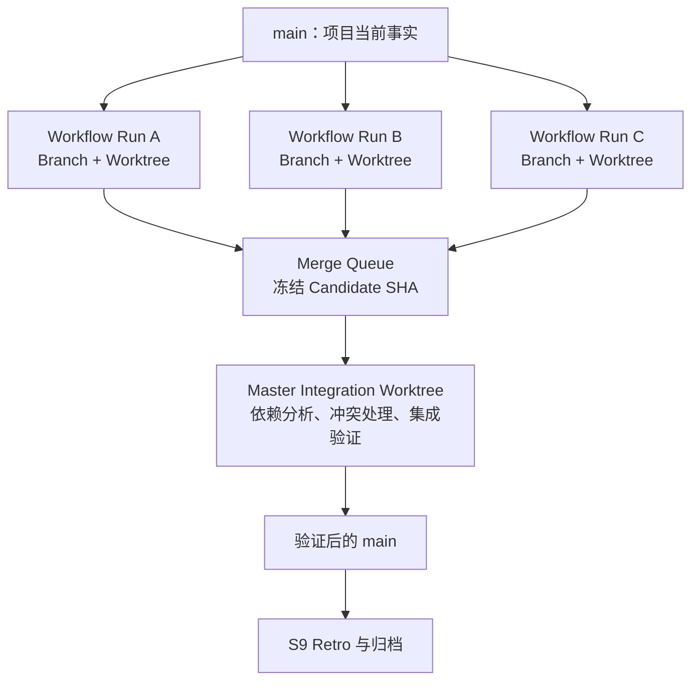
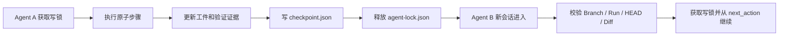
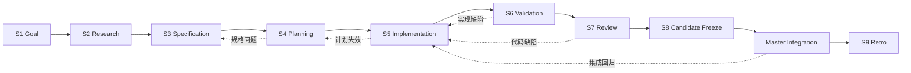
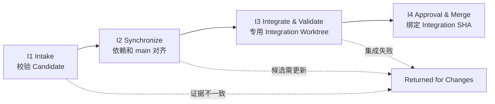

# Prompt-Driven Parallel Workflow v2：AI 可读全景指南

> **用途**：让 Claude Code、Codex 或其他兼容 Coding Agent 在不依赖原会话历史的情况下，理解并执行整套工作流。  
> **架构版本**：v2.0  
> **核心模型**：Agent-agnostic Nine-State Workflow + Branch/Worktree Isolation + Safe Takeover + Master Integration

---

## 0. 读取与执行约定

当 Agent 读取本文件时，应把它视为**全景教学说明**，而不是替代仓库中的权威协议。真正执行时，仍以以下文件为准：

1. 项目入口：`AGENTS.md` 或 `CLAUDE.md`；
2. 核心协议：`.workflow/core/*.md`；
3. 当前 Run：`.workflow/runs/<run-id>/state.json`；
4. 当前接管点：`.workflow/runs/<run-id>/checkpoint.json`；
5. 当前 State：`.workflow/states/<state>.md`；
6. Git Branch、Commit、Diff 和真实命令输出。

本工作流的第一原则是：

> **Prompt 负责引导，文件负责状态，Git 负责版本隔离，测试负责证明，人类负责关键门禁。**

---

## 1. 工作流解决的问题

普通 Coding Agent 会话容易出现四类问题：

- **状态漂移**：Agent 忘记当前目标、版本或步骤；
- **范围漂移**：未批准就扩大修改范围；
- **上下文依赖**：换会话或换 Agent 后无法继续；
- **并行冲突**：多个目标在同一仓库中互相污染，最终难以合并。

本架构将这些问题分别交给四种机制：

| 问题 | 机制 |
|---|---|
| 状态漂移 | `state.json`、版本化工件、Checkpoint |
| 范围漂移 | Goal/Spec/Plan 审批与 State Gate |
| Agent 切换 | 可移植 Checkpoint + 单写者 Lock |
| 并行目标 | 每个 Run 独立 Branch + Worktree |
| 合并冲突 | Master Integration Worktree |
| 自我误判 | 构建、测试、Diff、独立 Review |

---

## 2. 总体架构



### 2.1 四种权威事实

1. **Project Truth**：`main` 分支；
2. **Run Truth**：`workflow/<run-id>` 分支和对应 Run 工件；
3. **Candidate Truth**：冻结且已 Review 的 Candidate Commit SHA；
4. **Integration Truth**：在集成 Worktree 中验证过的 Integration Commit SHA。

Registry 和 Merge Queue 只是索引，不替代上述事实。

---

## 3. Run 隔离模型

每个目标必须满足：

```text
一个目标 = 一个 Run ID = 一个 Branch = 一个 Worktree = 一套 Run 工件
```

Run ID 格式：

```text
WF-YYYYMMDD-NNN-short-slug
```

绑定关系示例：

```text
Run ID:   WF-20260725-001-auth-refresh
Branch:   workflow/WF-20260725-001-auth-refresh
Worktree: ../.workflow-worktrees/WF-20260725-001-auth-refresh
Artifacts:.workflow/runs/WF-20260725-001-auth-refresh/
```

### 3.1 子 Run 的权限边界

子 Workflow Agent 可以：

- 修改当前 Worktree 的业务代码；
- 修改自己的 `.workflow/runs/<run-id>/`；
- 读取 `.workflow/project/` 中的稳定项目知识；
- 读取明确声明的已完成依赖。

子 Workflow Agent 不可以：

- 修改其他 Run 工件；
- 修改 `.workflow/control/`；
- 直接修改项目长期规则；
- 直接合并到 `main`；
- 修改冻结后的 Candidate；
- 未授权 Push、Deploy、Migration 或不可逆操作。

---

## 4. Claude Code 与 Codex 的对称执行

Claude Code 和 Codex 都可以执行任意合法 State。工作流不固定：

```text
Claude = 规划者
Codex = 实现者
```

而是定义：

```text
Claude 或 Codex = 当前 Workflow Agent
```

支持三种模式：

1. Claude Code 从 S1 执行到 S9；
2. Codex 从 S1 执行到 S9；
3. Claude 与 Codex 在安全 Checkpoint 处相互接管。

### 4.1 入口文件

- Codex 自动读取 `AGENTS.md`；
- Claude Code 读取 `CLAUDE.md`，其中导入 `@AGENTS.md`；
- 两者随后读取相同 `.workflow/` 协议。

### 4.2 可以迁移的内容

- Branch、HEAD、Diff；
- `state.json`；
- `checkpoint.json`；
- Goal、Spec、Plan；
- 验证和 Review 证据；
- 人类审批；
- 当前步骤与下一动作。

### 4.3 不可迁移的内容

- 原 Agent 的聊天历史；
- 私有推理和隐藏计划；
- UI 中未写入文件的待办；
- 产品私有 Memory；
- 未记录的人工决定。

因此切换属于**状态接管**，不是完整会话迁移。

---

## 5. 安全接管协议



### 5.1 安全 Checkpoint 必须满足

- 没有仍在运行且未记录的命令；
- 文件处于可理解状态；
- 修改文件已列出；
- 验证结果已记录；
- 失败尝试已记录；
- 开放风险已记录；
- `next_action` 足够具体；
- 可以释放写锁。

### 5.2 单写者 Lock

本地 Git 忽略文件：

```text
.workflow/runtime/agent-lock.json
```

同一 Worktree 任意时刻最多一个写入 Agent。第二个 Agent 只能只读观察，或在用户明确授权后强制接管。

### 5.3 异常退出

没有安全 Checkpoint 时，新 Agent 进入 Recovery Mode：

1. 初始只读；
2. 检查 Branch、HEAD、Git Status、Diff；
3. 读取所有当前工件；
4. 运行最小无破坏验证；
5. 重建 Checkpoint；
6. 标记不确定性；
7. 再继续执行。

---

## 6. 九 State 工作流



### S1 - Goal

**问题**：到底要实现什么？

输出：

- 目标结果；
- 成功标准；
- 范围和非目标；
- 约束、假设和风险；
- Goal 版本。

禁止修改业务代码。退出需要：

```text
APPROVE GOAL <run-id> vN
```

### S2 - Research

**问题**：项目当前真实情况是什么？

只读调查：代码结构、调用链、配置、现有模式、测试方式和风险。重要结论必须附文件路径或命令证据。

### S3 - Specification

**问题**：什么条件成立才算完成？

输出功能/非功能要求、边界、错误行为、兼容性和可验证 Acceptance Criteria。Spec 不应过度绑定实现方案。

### S4 - Planning

**问题**：用什么最小充分方案实现？

输出方案权衡、文件范围、原子步骤、逐步验证、依赖、风险和回滚。退出需要：

```text
APPROVE PLAN <run-id> vN
```

### S5 - Implementation

**问题**：如何按批准计划小步实现？

每个步骤执行：

```text
Read -> Edit -> Focused Verify -> Update Progress -> Checkpoint
```

禁止静默改变 Plan、无关重构和未授权外部操作。

### S6 - Validation

**问题**：实现是否按照 Spec 正确工作？

使用构建、测试、类型检查、Lint、运行行为等外部证据。每条验收标准只能是：

```text
PASS / FAIL / NOT RUN / NOT APPLICABLE
```

### S7 - Review

**问题**：这份实现是否值得成为合并候选？

Review 关注 Goal/Spec 覆盖、无关改动、安全、性能、架构、可维护性和测试质量。Finding 必须包含严重性、文件位置、证据、影响和建议。

### S8 - Candidate Freeze

**问题**：被验证与 Review 的内容是否与最终待合并内容完全一致？

要求工作区干净、产生 Commit、记录 Candidate SHA，并让 Validation、Review、Impact 全部绑定同一 SHA。审批：

```text
APPROVE CANDIDATE <run-id> <candidate-sha>
```

冻结后子 Agent 不得继续修改。SHA 变化会使原审批、Validation 和 Review 全部失效。

### Master Integration

不属于子 Run 的第十个 State，而是项目级流程，见第 9 节。

### S9 - Retro

仅在 `merged`、`cancelled` 或 `terminal_failed` 后执行。复盘必须包含集成阶段发生的问题，并只生成改进提案，不自动修改全局规则。

---

## 7. State 回退和失败分类

发现失败后先分类，禁止只在当前步骤反复修补。

| 失败类别 | 路由 |
|---|---|
| 暂时环境错误 | 当前 State 有界重试 |
| 局部实现缺陷 | S5 |
| 验证设计缺陷 | S6 |
| Plan 假设失效 | S4，旧审批失效 |
| Spec 歧义 | S3 |
| Goal 冲突 | S1 |
| 能力不足 | `BLOCKED_BY_CAPABILITY` |
| 权限/不可逆风险 | 人工升级 |
| 集成组合回归 | Master 分类后退回相关 Run |

Loop 进入 Plateau 的典型信号：同一错误两次、两轮无进展、Diff 反复撤销、同一命令无新假设重复执行。达到预算后必须换策略、回退或升级人工。

---

## 8. 工件体系

### 8.1 机器可读工件

#### `state.json`

权威流程状态：Run 身份、Branch/Worktree 绑定、生命周期、当前 State、版本、审批、Loop 预算、Candidate、当前 Agent 和下一动作。

#### `checkpoint.json`

跨 Agent 接管状态：HEAD、Dirty 状态、当前步骤、完成与待办、改动文件、验证、失败尝试、活动进程、风险和 `next_action`。

#### `impact.json`

记录 Planned 与 Actual 影响面：文件、模块、接口、行为、数据模型、配置、依赖、Migration 和项目级更新提案。

### 8.2 人类可读工件

- `goal.md`
- `research.md`
- `spec.md`
- `plan.md`
- `progress.md`
- `validation.md`
- `review.md`
- `candidate.md`
- `retro.md`
- `decisions.md`
- `transitions.md`

### 8.3 版本失效规则

- Goal 变化可能使 Spec/Plan 失效；
- Spec 变化使 Plan 审批失效；
- Plan 变化使旧 Plan 审批失效；
- Candidate SHA 变化使 Candidate 审批、Validation 和 Review 失效；
- Integration SHA 变化使 Integration 审批失效。

---

## 9. Master Integration



### I1 - Intake

校验 Candidate SHA、审批、Validation/Review SHA 绑定、工作区冻结、Impact、依赖和风险。

### I2 - Synchronization

按照依赖关系确定合并顺序，对比最新 `main`。如果同步改变了 Candidate 的实质内容，必须重新获得验证与 Review 证据。

### I3 - Integration Validation

在独立 `integration/<integration-id>` Worktree 中合并候选，并检查：

- 文本冲突；
- API/行为语义冲突；
- 数据和配置冲突；
- 架构一致性；
- Build、全量相关测试、Lint、Typecheck；
- 跨 Workflow 验收行为；
- Migration 与回滚安全。

Git 自动合并成功不等于语义正确。

### I4 - Approval & Merge

审批绑定精确 Integration SHA：

```text
APPROVE INTEGRATION <integration-id> <integration-sha>
```

随后才能合并回 `main`，更新 Registry/Queue，并允许相关 Run 进入 S9。

---

## 10. 权威信息优先级

从高到低：

1. 写入工件的人类明确决定；
2. Git Branch、Commit、Diff 和真实命令输出；
3. `state.json`；
4. `checkpoint.json`；
5. 已批准 Goal/Spec/Plan；
6. `.workflow/project/`；
7. 共享协议；
8. 聊天历史和模型推断。

Agent 不得用低层信息覆盖高层事实。

---

## 11. 人工审批 Token

```text
APPROVE GOAL <run-id> vN
APPROVE PLAN <run-id> vN
APPROVE CANDIDATE <run-id> <candidate-sha>
APPROVE INTEGRATION <integration-id> <integration-sha>
ACCEPT RISK <run-id> <risk-id>
AUTHORIZE ACTION <run-id> <action-id>
FORCE TAKEOVER <run-id> BY <agent>
```

模糊表达不能自动成为批准。审批必须写入 `decisions.md` 和 `state.json`。

---

## 12. 标准启动方法

### 12.1 创建新 Run

在主仓库：

```powershell
pwsh .workflow/tools/workflow.ps1 doctor
pwsh .workflow/tools/workflow.ps1 new-run `
  -Title "目标描述" `
  -Slug "short-slug"
```

### 12.2 打开 Worktree 后的第一句话

```text
开始当前 Worktree 对应的 Workflow。
请读取入口规则文件，根据当前 Git Branch 确定 Run ID，读取 state.json、checkpoint.json、当前 State 规则和必需工件。
先验证 Branch、Run ID、State 和 Worktree 是否一致，然后从 next_action 继续。
如果这是新 Run，请从 S1 Goal 开始，不要立即修改业务代码。
```

### 12.3 接管提示

```text
接管当前 Workflow。使用新会话读取入口规则、state.json、checkpoint.json、当前 State 和 Git Diff。
验证 Branch/Run/HEAD 一致，获取本地写锁后，从 next_action 继续。不要重新启动整个 Workflow。
```

---

## 13. 不变量清单

1. 一个目标对应一个 Run；
2. 一个 Run 对应一个 Branch；
3. 一个 Branch 对应一个 Worktree；
4. Branch 名决定 Run ID；
5. 一个 Worktree 同时只有一个写入 Agent；
6. Agent 切换只发生在安全 Checkpoint；
7. 子 Run 不能修改全局 Control；
8. 子 Run 不能直接合并 `main`；
9. Candidate SHA 冻结后不可变；
10. SHA 变化会使相关证据和审批失效；
11. 所有集成在独立 Integration Worktree 中进行；
12. S9 在终局结果之后执行；
13. 聊天历史和产品私有 Memory 不是权威状态；
14. “模型认为完成”不是退出条件，外部证据才是。

---

## 14. Agent 执行时的最小检查表

每次开始：

```text
[ ] 我在哪个 Git Branch？
[ ] Branch 对应哪个 Run ID？
[ ] state.json 是否与 Branch 一致？
[ ] 当前 State 和 next_action 是什么？
[ ] 当前版本和审批是否有效？
[ ] 写锁是否可获取？
[ ] 当前 State 需要哪些工件和能力？
```

每次结束：

```text
[ ] 代码和工件是否同步更新？
[ ] 命令与证据是否真实记录？
[ ] 是否产生了安全 Checkpoint？
[ ] 下一动作是否明确？
[ ] 是否需要释放写锁或请求审批？
```

---

## 15. 一句话总结

> 这套工作流把 Coding Agent 从“依赖聊天上下文的临时执行者”变成“在 Git 隔离、显式状态、可验证证据和人工门禁下工作的可接管执行者”。
